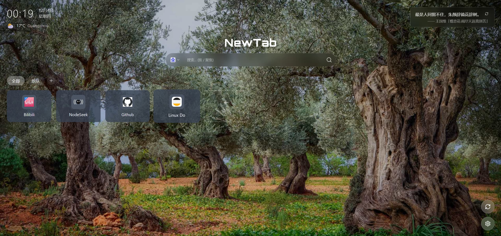

# NewTab

简洁美观的浏览器新标签页扩展。

## 截图



## 功能

- 时钟 / 天气 / 一言
- 网站快捷卡片，支持分组与拖拽排序
- 多搜索引擎切换
- 主题定制（深色/浅色/主题色/壁纸）
- 数据本地备份 & WebDAV 云同步

## 安装

```bash
npm install
npm run build
```

加载扩展：Chrome → `chrome://extensions/` → 开启开发者模式 → 加载已解压的扩展程序 → 选择 `dist` 目录

## 开发

```bash
npm run dev     # 启动开发服务器
npm run lint    # 代码检查
npm run build   # 构建生产版本
```

## 技术栈

React 18 / TypeScript / Vite / Tailwind CSS / Zustand / Framer Motion / @dnd-kit

## License

MIT
